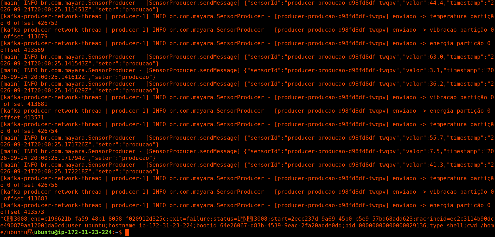
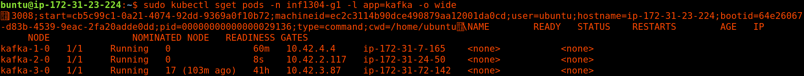
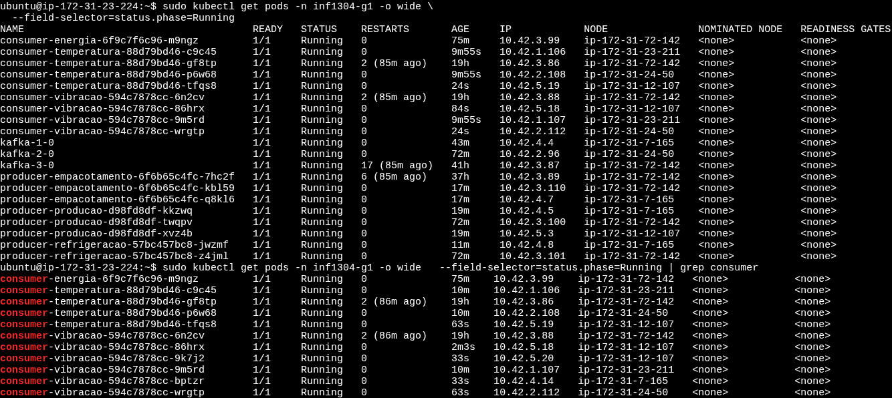
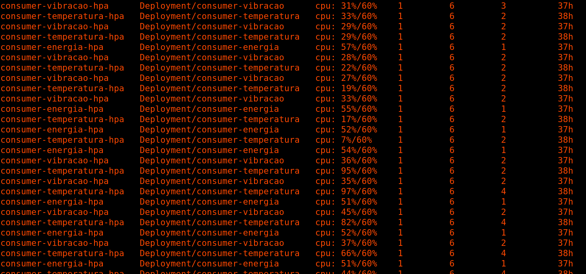
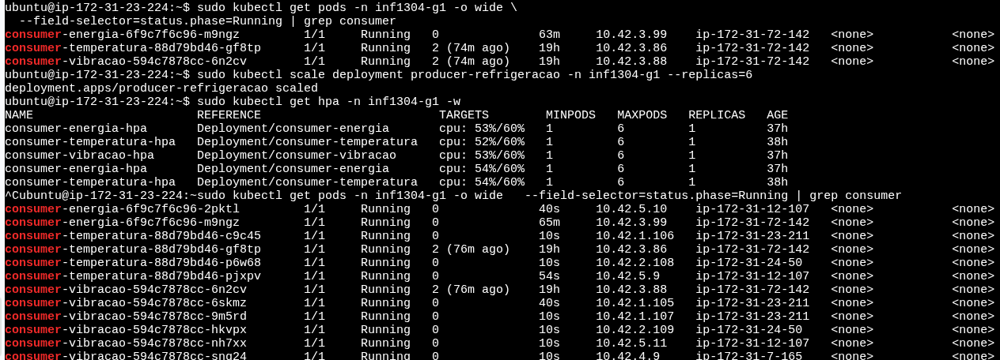
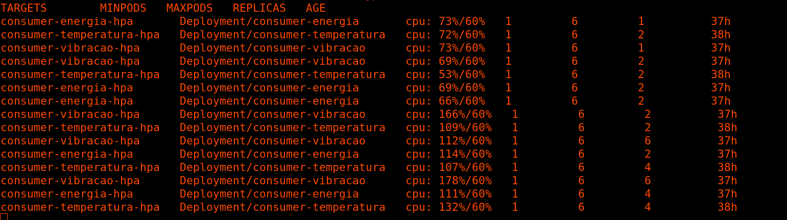
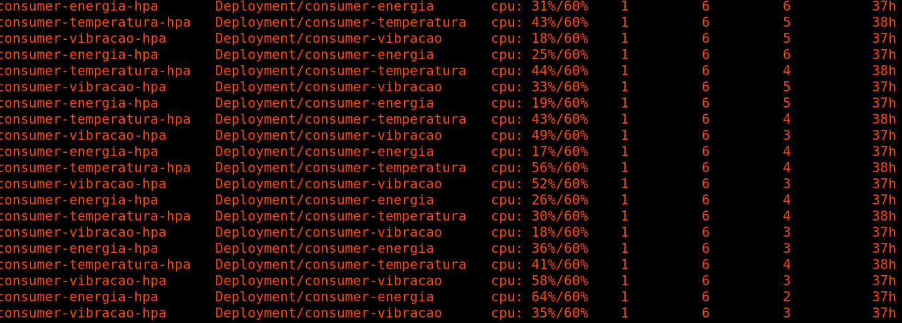
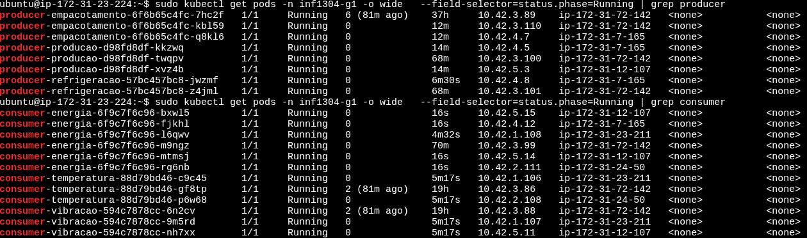
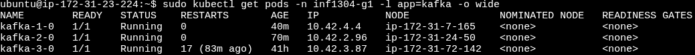

# INF1304 - Distribuição e Concorrência

**Autoras:**
- Maria Eduarda da Fonseca Gonçalves Santos - 2212985
- Mayara Ramos Damazio - 2210833

---

## 1. Documentação de instalação e uso

Para acessar o mini mundo, é necessário acessar as instâncias EC2 da AWS, nas quais estão rodando o nosso cluster Kubernetes.

Para isso, acessar a instância EC2 utilizando o seguinte par de chave SSH (`.pem`):

```bash
chmod 400 "SmartFactory.pem"
```

### 1.1 Instalação do cluster Kubernetes

Estando com acesso às instâncias EC2, siga os passos abaixo.

#### 1.1.1 Control Plane

Clonar o repositório com a arquitetura do nosso mini mundo:

```bash
git clone https://github.com/AgenteMaya/trab_G1_INF1304
```

Baixar o Kubernetes e criar o cluster:

```bash
curl -sfL https://get.k3s.io | sh -s - server
```

Gerar o token:

```bash
sudo cat /var/lib/rancher/k3s/server/node-token
```

Pegar o endereço IP:

```bash
ifconfig
```

Guardar o *token* e o endereço IP para os próximos passos.

#### 1.1.2 Nos Workers

Definir variáveis de ambiente:

```bash
IP_PRIVADO_CP=[ip]
TOKEN=[token]
```

Baixar e rodar o Kubernetes e juntar ao cluster criado no Control Plane:

```bash
curl -sfL https://get.k3s.io | K3S_URL=https://$IP_PRIVADO_CP:6443 K3S_TOKEN=$TOKEN sh -
```

### 1.2 Verificar o cluster

No Control Plane, verificar se os nós dos workers estão de pé (precisam ser listados com o status `READY`):

```bash
sudo kubectl get nodes
```

Ainda no Control Plane, ativar os YAMLs:

```bash
sudo kubectl apply -f k8s/namespace.yaml
sudo kubectl apply -f k8s/kafka.yaml
sudo kubectl apply -f k8s/sensores.yaml
sudo kubectl apply -f k8s/consumidor.yaml
```

Verificar se os três brokers estão rodando:

```bash
sudo kubectl get pods -n inf1304-g1 -l app=kafka -w
```

Com os clusters rodando, podemos prosseguir com os seguintes comandos para ativar os produtores e consumidores:

```bash
sudo kubectl apply -f k8s/producer-producao.yaml
sudo kubectl apply -f k8s/producer-refrigeracao.yaml
sudo kubectl apply -f k8s/producer-empacotamento.yaml
sudo kubectl apply -f k8s/consumer-temperatura.yaml
sudo kubectl apply -f k8s/consumer-vibracao.yaml
sudo kubectl apply -f k8s/consumer-energia.yaml
```

Podemos ativar também o *autoscaler* (HPA), mas antes precisamos verificar se o Metrics Server, do qual ele depende para funcionar, está ativo:

```bash
sudo kubectl get pods -n kube-system | grep metrics-server
sudo kubectl apply -f k8s/hpa.yaml
```

Verificar se está tudo certo:

```bash
sudo kubectl get pods -n inf1304-g1 -o wide
sudo kubectl get svc -n inf1304-g1
```

---

## 2. Explicação da arquitetura

O objetivo deste trabalho foi simular o monitoramento dos dados recebidos de sensores espalhados por uma fábrica, seguindo o padrão produtor/consumidor sobre Apache Kafka, utilizando Kubernetes + Docker Compose para prover o balanceamento de carga, elasticidade e tolerância a falhas do sistema da fábrica.

Os sensores são simulados pela classe `SensorProducer`, que periodicamente publica, em formato JSON, dados de temperatura, vibração e energia — esses sensores são serviços descritos no `docker-compose.yaml`. Esses dados enviados são consumidos pela classe `SensorConsumer`, que lê as mensagens produzidas pelo `SensorProducer`, detecta anomalias e realiza o seu registro em loggers.

O Kubernetes implementado garante que, se um componente falhar ou a carga aumentar, o sistema se ajusta automaticamente, sem a necessidade de intervenção manual.

### 2.1 Componentes

**Sensores (Produtores)**

Temos três *deployments* de sensores, um por cada setor da fábrica: `producer-producao`, `producer-refrigeracao`, `producer-empacotamento` (`k8s/producer-*.yaml`). Cada sensor publica leituras de temperatura, vibração e energia, com o `sensorId` como chave da mensagem, garantindo que as leituras de um mesmo sensor fiquem sempre na mesma partição, em ordem. As mensagens são publicadas nos seguintes tópicos Kafka: `temperatura`, `vibracao`, `energia`.

**Consumidores**

São feitos três *deployments*, um por tópico: `consumer-temperatura`, `consumer-vibracao`, `consumer-energia` (`k8s/consumer-*.yaml`). Cada deployment define um `KAFKA_GROUP_ID` fixo e compartilhado entre suas réplicas, o que permite ao Kafka dividir automaticamente as partições do tópico correspondente entre as réplicas ativas — configurando a base do balanceamento de carga entre consumidores.

Os limites de anomalia (`SENSOR_MIN`, `SENSOR_MAX`) são definidos no próprio consumidor, e não no produtor: o produtor apenas simula os dados do sensor, e é o consumidor quem aplica a regra de negócio para classificar uma leitura como normal ou anômala.

Por fim, a conexão com o cluster usa os endereços estáveis do *service headless* (`kafka-N-0.kafka-headless:9092`), garantidos pelo *StatefulSet* dos brokers.

**Cluster Kafka**

O cluster roda dentro do próprio cluster Kubernetes (`k8s/kafka.yaml`), eliminando a necessidade de infraestrutura separada para o Kafka. Cada broker (`kafka-1`, `kafka-2`, `kafka-3`) é um *StatefulSet* independente, com 1 réplica cada, em modo *KRaft* (broker + controller no mesmo processo, sem Zookeeper).

Um *service* do tipo *headless* dá a cada broker um endereço de rede estável, necessário para o quorum de controllers se formar de maneira consistente. O `podAntiAffinity` obriga o Kubernetes a agendar os três brokers em *workers* diferentes — sem essa regra, dois brokers poderiam acabar no mesmo worker, e a queda de um nó derrubaria mais de um broker ao mesmo tempo. Cada broker tem um volume persistente de 2Gi, preservando os dados caso o pod seja recriado.

Os pods do cluster rodam apenas nos workers. Para evitar que qualquer deployment de pod fosse feito no control plane, utilizamos o comando:

```bash
sudo kubectl taint nodes ip-172-31-23-224 node-role.kubernetes.io/control-plane:NoSchedule
```

**Elasticidade**

A elasticidade do sistema é configurada via `HorizontalPodAutoscaler`, um por consumidor, definido em `k8s/hpa.yaml`. Cada HPA varia entre 1 e 6 réplicas, escalando com base no uso médio de CPU (alvo de 60%), com uma janela de estabilização de 60 segundos antes de reduzir réplicas — isso evita que o sistema fique oscilando o número de pods a cada pequena flutuação de carga.

A elasticidade é aplicada apenas aos consumidores, e não aos produtores: os produtores geram uma taxa de mensagens previsível e constante, enquanto os consumidores é que precisam se ajustar dinamicamente conforme o volume de dados a processar.

---

## 3. Testes de falha e exibição dos resultados

Para averiguar a resistência do nosso sistema, foram realizados os seguintes testes de falha:

### 3.1 Teste 1 - Queda de um broker Kafka

**Objetivo**: verificar que o sistema continua publicando e consumindo mensagens mesmo com um dos três brokers fora do ar.

**Procedimento**:

1. Verificar o estado inicial do cluster:

```bash
sudo kubectl get pods -n inf1304-g1 -l app=kafka -o wide
```


2. Remover um dos pods do broker (simulando a falha):

```bash
sudo kubectl scale statefulset kafka-2 -n inf1304-g1 --replicas=0
```

3. Observar os produtores e consumidores continuando a funcionar durante a queda:

```bash
sudo kubectl logs -f deployment/producer-producao -n inf1304-g1
```





4. Observar o Kubernetes recriando o pod do broker automaticamente:

```bash
sudo kubectl get pods -n inf1304-g1 -l app=kafka -w
```


**Resultado esperado**: os produtores e consumidores não param, apenas podem apresentar um breve atraso ou alguns avisos de reconexão nos logs enquanto o broker está fora. O Kubernetes recria o pod (`kafka-2-0`) automaticamente, que se reconecta ao cluster e recupera os dados replicados pelos outros dois brokers.

### 3.2 Teste 2 - Queda de um pod consumidor

**Objetivo**: verificar que o Kubernetes substitui automaticamente um consumidor que falha, e que o Kafka reatribui a ele as partições que ficaram sem dono.

**Procedimento**:

1. Escalar o consumidor para mais de 1 réplica, para que a redistribuição de partições seja visível:

```bash
sudo kubectl scale deployment consumer-temperatura --replicas=3 -n inf1304-g1
```

2. Verificar quais pods estão no ar:

```bash
sudo kubectl get pods -n inf1304-g1 -l app=consumer-temperatura
```



3. Remover um dos pods:

```bash
sudo kubectl delete pod [nome-do-pod] -n inf1304-g1
```

4. Observar o Kubernetes criar um novo pod, e os logs mostrando o rebalanceamento das partições entre os consumidores restantes:

```bash
sudo kubectl get pods -n inf1304-g1 -l app=consumer-temperatura -w
sudo kubectl logs -f [novo-pod] -n inf1304-g1
```




**Resultado esperado**: um novo pod é criado com outro nome, entra no mesmo `group.id` (`temperatura-consumer`) e o Kafka reatribui a ele parte das partições que antes pertenciam ao pod removido. Nenhuma mensagem deixa de ser processada; no máximo há uma pequena pausa durante o rebalanceamento.

### 3.3 Teste 3 - Elasticidade sob carga (HPA)

**Objetivo**: demonstrar que o número de réplicas do consumidor aumenta automaticamente sob carga, e diminui quando a carga cessa.

**Procedimento**:

1. Monitorar o HPA e os pods em um terminal:

```bash
sudo kubectl get hpa -n inf1304-g1 -w
```

2. Gerar carga artificial (aumentando o número de produtores):

```bash
sudo kubectl scale deployment producer-refrigeracao -n inf1304-g1 --replicas=2
sudo kubectl get pods -n inf1304-g1 -o wide --field-selector=status.phase=Running | grep producer
```


3. Observar o HPA aumentando as réplicas conforme o uso de CPU ultrapassa 60%.





4. Interromper a geração de carga e observar as réplicas diminuindo após a janela de estabilização de 60 segundos.





**Resultado esperado**: o número de réplicas de `consumer-temperatura` sobe de 1 até no máximo 6 conforme a CPU aumenta, e volta a diminuir gradualmente depois que a carga cessa.

### 3.4 Teste 4 - Distribuição dos brokers entre nós (podAntiAffinity)

**Objetivo**: confirmar que os três brokers Kafka realmente ficam em workers diferentes, o que garante que a queda de uma única EC2 não derrube mais de um broker.

**Procedimento**:

```bash
sudo kubectl get pods -n inf1304-g1 -l app=kafka -o wide
```

