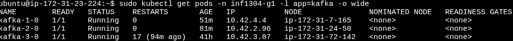
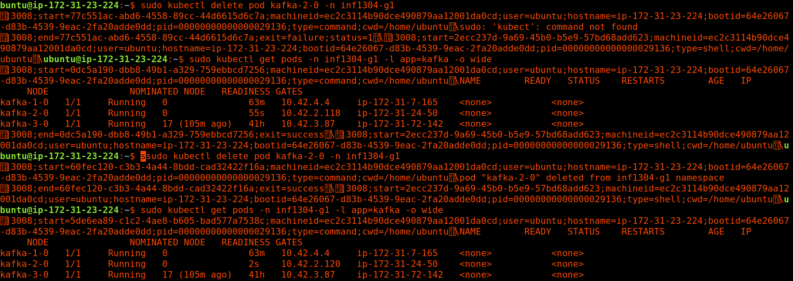
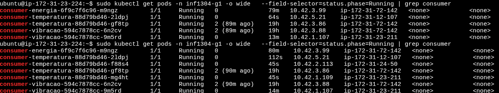
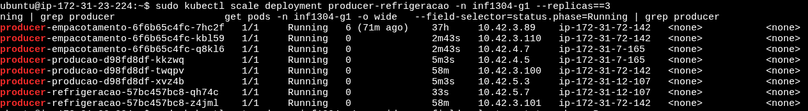

# INF1304 — Distribuição e Concorrência

Maria Eduarda da Fonseca Gonçalves Santos — 2212985  
Mayara Ramos Damazio — 2210833

## 1. Documentação de instalação e uso

Para acessar o mini mundo, é necessário acessar as instâncias EC2 da AWS, nas quais está rodando o nosso cluster Kubernetes.

Para isso, acessar a instância EC2 utilizando a chave SSH (`.pem`):

```bash
chmod 400 "SmartFactory.pem"
```

### 1.1 Instalação do cluster Kubernetes

Estando com acesso às instâncias EC2, siga os passos abaixo.

#### 1.1.1 Control Plane

Clonar o repositório com a arquitetura do mini mundo:

```bash
git clone https://github.com/AgenteMaya/trab_G1_INF1304
```

Baixar o Kubernetes e criar o cluster:

```bash
curl -sfL https://get.k3s.io | sh -s - server
```

Gerar o token e obter o endereço IP:

```bash
sudo cat /var/lib/rancher/k3s/server/node-token
ifconfig
```

Guardar o token e o IP para os próximos passos.

#### 1.1.2 Nos Workers

Definir variáveis de ambiente:

```bash
IP_PRIVADO_CP=[ip]
TOKEN=[token]
```

Baixar e rodar o Kubernetes e juntar ao cluster criado no Control Plane:

```bash
curl -sfL https://get.k3s.io | K3S_URL=https://$IP_PRIVADO_CP:6443 K3S_TOKEN=$TOKEN sh -
```

### 1.2 Verificar o cluster

No Control Plane, verificar se os workers estão de pé; precisam ser listados com o status `Ready`:

```bash
sudo kubectl get nodes
```

Ainda no Control Plane, ativar os YAMLs:

```bash
sudo kubectl apply -f k8s/namespace.yaml
sudo kubectl apply -f k8s/kafka.yaml
sudo kubectl apply -f k8s/sensores.yaml
sudo kubectl apply -f k8s/consumidor.yaml
```

Verificar se os três brokers estão rodando:

```bash
sudo kubectl get pods -n inf1304-g1 -l app=kafka -w
```

Com o cluster rodando, ativar produtores e consumidores:

```bash
sudo kubectl apply -f k8s/producer-producao.yaml
sudo kubectl apply -f k8s/producer-refrigeracao.yaml
sudo kubectl apply -f k8s/producer-empacotamento.yaml

sudo kubectl apply -f k8s/consumer-temperatura.yaml
sudo kubectl apply -f k8s/consumer-vibracao.yaml
sudo kubectl apply -f k8s/consumer-energia.yaml
```

Podemos ativar também o autoscaler (HPA), mas antes precisamos verificar se o Metrics Server, do qual ele depende, está ativo:

```bash
sudo kubectl get pods -n kube-system | grep metrics-server
sudo kubectl apply -f k8s/hpa.yaml
```

Verificar se está tudo certo:

```bash
sudo kubectl get pods -n inf1304-g1 -o wide
sudo kubectl get svc -n inf1304-g1
```

## 2. Explicação da arquitetura

O objetivo deste trabalho foi simular o monitoramento dos dados recebidos de sensores espalhados por uma fábrica, seguindo o padrão produtor/consumidor sobre Apache Kafka, utilizando Kubernetes + Docker Compose para prover balanceamento de carga, elasticidade e tolerância a falhas do sistema da fábrica.

Os sensores são simulados pela classe `SensorProducer`, que periodicamente publica, em formato JSON, dados de temperatura, vibração e energia. Esses sensores são serviços descritos no `docker-compose.yaml`. Os dados são consumidos pela classe `SensorConsumer`, que lê as mensagens produzidas pela `SensorProducer`, detecta anomalias e realiza seu registro em logs.

O Kubernetes implementado garante que, se um componente falhar ou a carga aumentar, o sistema se ajuste automaticamente, sem necessidade de intervenção manual.

### 2.1 Componentes

#### Sensores (produtores)

Temos três deployments de sensores, um para cada setor da fábrica: `producer-producao`, `producer-refrigeracao` e `producer-empacotamento` (`k8s/producer-*.yaml`). Cada sensor publica leituras de temperatura, vibração e energia, com o `sensorId` como chave da mensagem, garantindo que as leituras de um mesmo sensor fiquem sempre na mesma partição, em ordem. As mensagens são publicadas nos tópicos Kafka `temperatura`, `vibracao` e `energia`.

#### Consumidores

São feitos três deployments, um por tópico: `consumer-temperatura`, `consumer-vibracao` e `consumer-energia` (`k8s/consumer-*.yaml`). Cada deployment define um `KAFKA_GROUP_ID` fixo e compartilhado entre suas réplicas. Isso permite ao Kafka dividir automaticamente as partições do tópico correspondente entre as réplicas ativas, formando a base do balanceamento de carga entre consumidores.

Os limites de anomalia, `SENSOR_MIN` e `SENSOR_MAX`, são definidos no próprio consumidor, não no produtor: o produtor apenas simula os dados do sensor, e o consumidor aplica a regra de negócio para classificar uma leitura como normal ou anômala.

A conexão com o cluster usa os endereços estáveis do service headless (`kafka-N-0.kafka-headless:9092`), garantidos pelos StatefulSets dos brokers.

#### Cluster Kafka

O cluster Kafka roda dentro do próprio cluster Kubernetes (`k8s/kafka.yaml`), eliminando a necessidade de infraestrutura separada. Cada broker (`kafka-1`, `kafka-2`, `kafka-3`) é um StatefulSet independente, com uma réplica, em modo KRaft, com broker e controller no mesmo processo, sem ZooKeeper.

Um service headless dá a cada broker um endereço de rede estável, necessário para o quorum de controllers. `podAntiAffinity` obriga o Kubernetes a agendar os três brokers em workers diferentes: sem essa regra, dois brokers poderiam ficar no mesmo worker e a queda de um nó derrubaria mais de um broker. Cada broker tem um volume persistente de 2 GiB, preservando os dados caso o pod seja recriado.

Os pods do cluster rodam apenas nos workers. O trecho referente ao comando de `taint` no PDF original aparece truncado: `sudo kubectl taint nodes ip-172-31-23-224 node-role.kusudo kubectl taint nodes`.

#### Elasticidade

A elasticidade do sistema é configurada via `HorizontalPodAutoscaler`, um por consumidor, no arquivo `k8s/hpa.yaml`. Cada HPA varia entre 1 e 6 réplicas, escalando com base no uso médio de CPU (alvo de 60%), com uma janela de estabilização de 60 segundos antes de reduzir réplicas. Isso evita oscilações no número de pods a cada pequena flutuação de carga.

A elasticidade se aplica aos consumidores: os produtores geram uma taxa de mensagens previsível e constante, enquanto os consumidores precisam se ajustar dinamicamente ao volume de dados a processar.

## 3. Testes de falha

Para averiguar a resistência do sistema, foram realizados os seguintes testes.

### 3.1 Teste 1 — Queda de um broker Kafka

**Objetivo:** verificar que o sistema continua publicando e consumindo mensagens mesmo com um dos três brokers fora do ar.

**Procedimento:**

1. Verificar o estado inicial do cluster:

   ```bash
   sudo kubectl get pods -n inf1304-g1 -l app=kafka -o wide
   ```

2. Remover um dos pods do broker (simulando a falha):

   ```bash
   sudo kubectl scale statefulset kafka-2 -n inf1304-g1 --replicas=0
   ```

3. Observar os produtores e consumidores durante a queda:

   ```bash
   sudo kubectl logs -f deployment/producer-producao -n inf1304-g1
   ```

   O PDF também apresenta o seguinte comando após esse passo:

   ```bash
   sudo kubectl delete pod kafka-2-0 -n inf1304-g1
   ```

4. Observar o Kubernetes recriando o pod do broker:

   ```bash
   sudo kubectl get pods -n inf1304-g1 -l app=kafka -w
   ```




**Resultado esperado:** os produtores e consumidores não param; podem apresentar breve atraso ou avisos de reconexão nos logs. O Kubernetes recria o pod `kafka-2-0`, que se reconecta ao cluster e recupera os dados replicados pelos outros brokers.

**Evidência indicada no PDF:** `[print dos logs do produtor durante a queda, mostrando continuidade de envio; print do kubectl get pods -w mostrando o pod sendo recriado]`.

### 3.2 Teste 2 — Queda de um pod consumidor

**Objetivo:** verificar que o Kubernetes substitui automaticamente um consumidor que falha e que o Kafka reatribui as partições que ficaram sem dono.

**Procedimento:**

1. Escalar o consumidor para mais de uma réplica, para tornar visível a redistribuição de partições:

   ```bash
   sudo kubectl scale deployment consumer-temperatura --replicas=3 -n inf1304-g1
   ```

2. Verificar quais pods estão no ar:

   ```bash
   sudo kubectl get pods -n inf1304-g1 -l app=consumer-temperatura
   ```

3. Remover um dos pods:

   ```bash
   sudo kubectl delete pod [nome-do-pod] -n inf1304-g1
   ```

4. Observar a criação de um novo pod e os logs do rebalanceamento:

   ```bash
   sudo kubectl get pods -n inf1304-g1 -l app=consumer-temperatura -w
   sudo kubectl logs -f [novo-pod] -n inf1304-g1
   ```




**Resultado esperado:** um novo pod é criado com outro nome, entra no mesmo `group.id` (`temperatura-consumer`) e recebe parte das partições antes atribuídas ao pod removido. Pode ocorrer uma pequena pausa durante o rebalanceamento.

### 3.3 Teste 3 — Elasticidade sob carga (HPA)

**Objetivo:** demonstrar que o número de réplicas do consumidor aumenta automaticamente sob carga e diminui quando ela cessa.

**Procedimento:**

1. Monitorar o HPA e os pods em um terminal:

   ```bash
   sudo kubectl get hpa -n inf1304-g1 -w
   ```

2. Gerar carga artificial. O PDF mantém a anotação `[preencher: como a carga foi gerada — aumentando o número de produtores, reduzindo o SENSOR_INTERVAL_MS, ou outro método]` e apresenta estes comandos:

   ```bash
   sudo kubectl scale deployment producer-refrigeracao -n inf1304-g1 --replicas=2
   sudo kubectl get pods -n inf1304-g1 -o wide --field-selector=status.phase=Running | grep producer
   ```

3. Observar o HPA aumentando as réplicas quando o uso de CPU ultrapassa 60%.

4. Interromper a geração de carga e observar as réplicas diminuindo após a janela de estabilização de 60 segundos.








**Resultado esperado:** o número de réplicas de `consumer-temperatura` sobe de 1 até no máximo 6 conforme a CPU aumenta e diminui gradualmente quando a carga cessa.

### 3.4 Teste 4 — Distribuição dos brokers entre nós (`podAntiAffinity`)

**Objetivo:** confirmar que os três brokers Kafka ficam em workers diferentes, de modo que a queda de uma única EC2 não derrube mais de um broker.

**Procedimento:**

```bash
sudo kubectl get pods -n inf1304-g1 -l app=kafka -o wide
```

**Resultado esperado:** a coluna `NODE` mostra três nomes de nó diferentes para `kafka-1-0`, `kafka-2-0` e `kafka-3-0`.

## 4. Exibição dos resultados

### 4.1 Teste 1

O PDF não contém texto ou imagem adicional nesta subseção.

### 4.2 Teste 2

O PDF não contém texto ou imagem adicional nesta subseção.

### 4.3 Teste 3


### 4.4 Teste 4


